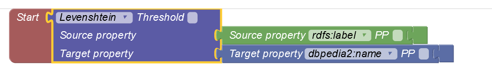

# Assignment 1 part 2

Authors: Akos Engelmann, Gergely Parady, Ipek Cakin, Simon Jasansky

## Methodology

### 1. Task: Converting the CSV to KG

First, we build two separate dataframes: one with the unique artists, and one with the unique genres. This needs to be done because artists and genres are duplicated in the music.csv data, but we only want to add them once to the knowledge graph. Therefore, we obtained music.csv, artists.csv and genres.csv

Additionally, we add columns for the IRI endings, where we replace spaces with underscores, in order to create valid IRI links. An example of this is to convert "Ed Sheeran" to "Ed_Sheeran", in order to create the IRI <https://www.example.org/Ed_Sheeran>

Then, we created the YARRRML configuration file (see attached) and converted the three CSV datafiles using the YARRRML MATEY online editor, obtaining a turtle file with the preliminary graph (see attached). 

### 2. Task: Using LIMES to link the graph to DBpedia

To use limes, we first converted the Turtle-graph to N-Triples. Then, after running LIMES WEB UI in a docker container and obtaining the XML file, we tried to run the .jar file via command line with the following setup: 

The XML file we used you can find attached. 

However, we repeatedly got an error regarding the specified path when using the command line. Also, the Web UI both with Docker container and the online version did not work. Thus, we could not do the linking. 

### 3. Add birth date and place 

As we had problems with linking to dbpedia using limes, we also could not complete this step of the assignment. 

### 4. Sparql queries

For the sparql queries, please see the queries.txt file. As we could not insert the birth place and date of artists, the variables relating to these are only conceptual and would not work for the graph (graph.ttl) we provided, but should work on a graph extended with these properties. 

